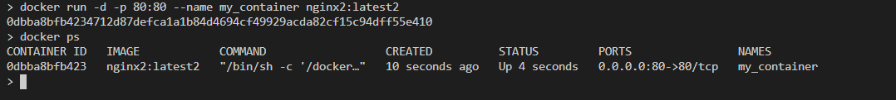
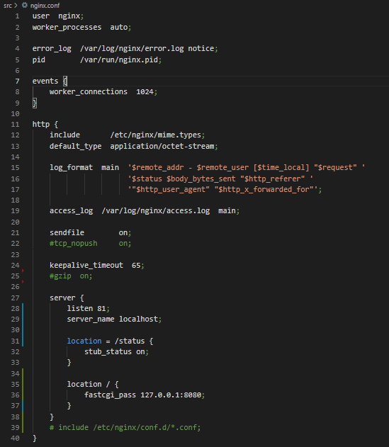
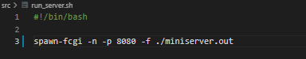

# Report

## Part 1. Ready-made docker

- making shure that docker is installed and docker engine is running
- getting nginx:
    
    

- check for the docker image with 'docker images':

    

- run docker image with 'docker run -d [image_id|repository]' and check that the image is running with 'docker ps':

    

- view container information with 'docker inspect [container_id|container_name]':

    

- - size:
 
    

- - ip:

    

- - list of mapped ports:

    

- stop docker image with 'docker stop [container_id|container_name]' and check that the image has stopped with 'docker ps'
    
    

- run docker with mapped ports 80 and 443 on the local machine with 'run' command:

    

- check that the nginx start page is available in the browser at localhost:80:

    

## Part 2. Operations with container

- creating:

    

- read the nginx.conf configuration file inside the docker container with the 'exec' command:

    

- create a nginx.conf file on a local machine:

    

- configure it on the /status path to return the nginx server status page:
- - copying:
    

- - configuring:
    

    Line 27 is commented because nginx takes other files of configurations which don't let location '/status' work properly.

- copy the created nginx.conf file inside the docker image using the 'docker cp' command and restart nginx inside the docker image with 'exec':

    

- check that localhost:80/status returns the nginx server status page:

    

- export the container to a container.tar file with the 'export' command:

    

- stop the container:

    

- delete the image with 'docker rmi [image_id|repository]' without removing the container first:

    

- delete stopped container:

    

- import the container back using the 'import' command:

    

- run the imported container:

    

- check that localhost:80/status returns the nginx server status page:

    

## Part 3. Mini web server

## Part 4. Your own docker

## Part 5. Dockle

## Part 6. Basic Docker Compose

